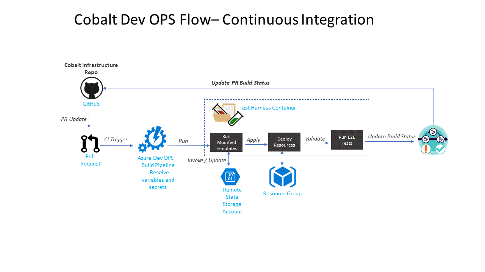

# Cobalt

[](https://dev.azure.com/csedallascrew/project-cobalt/_build/latest?definitionId=2&branchName=master)

This project is an attempt to combine and share best practices when building production ready [cloud native](https://www.cncf.io/) managed service solutions. Cobalt's infrastructure turn-key starter [templates](/infra/templates/README.md) are based on real world engagements with enterprise customers.

This project puts a focus on infrastructure scalability, security, automated testing and deployment repeatability and most importantly, developer experience. Cobalt's intended audience is for developers. Feedback and suggestions are encouraged through issue requests. We welcome contributions across any one of the major cloud providers.

Cobalt is a joint collaboration with project [Bedrock](https://github.com/Microsoft/bedrock). One of the project goals is to predictlably create, change and improve infrastructure.

This project offers a set of continuous integration pipelines responsible for testing and deploying templated environments to cloud provider(s).

## How Cobalt differs from Bedrock

Cobalt hosts reusable Terraform modules to scaffold managed container services like [ACI](https://docs.microsoft.com/en-us/azure/container-instances/) and [Application Services](https://docs.microsoft.com/en-us/azure/app-service/) as a couple of examples. Bedrock targets Kubernetes-based container orchestration workloads while following a [GitOps](https://medium.com/@timfpark/highly-effective-kubernetes-deployments-with-gitops-c7a0354f1446) devops flow. Cobalt templates reference Terraform modules like virtual networks, traffic manager, etc.

## About the Repository

### Infrastructure as Code

Cobalt infrastructure templates are written in Terraform and can be found in the templates [folder](infra/templates). Each subfolder represents a unique deployment schema and is packaged with a set of Terraform scripts, overview and setup instructions and automated unit & integration tests.

Each template makes use of Terraform [modules](https://www.terraform.io/docs/modules/index.html) across both Bedrock and [Cobalt](infra/modules). Cobalt's module registry is categorized by cloud provider then resource type. Each modules represents an absraction for the set of related cloud infrastructure objects that the module will manage.

```bash
$ tree infra
├───modules
│   └───providers
│       ├───azure
│       │   ├───api-mgmt
│       │   ├───app-gateway
│       │   ├───provider
│       │   ├───service-plan
│       │   ├───tm-endpoint-ip
│       │   ├───tm-profile
│       │   └───vnet
│       └───common
└───templates
    ├───az-hello-world
    │   └───test
    │       └───integration
    └───backend-state-setup
```

### Continuous Integration / Deployment + Testing

Cobalt Continuous Integration pipeline defintions are available in the `./devops/provider` folder. As of today, Cobalt provides a git devops worklfow [definition](devops/providers/azure-devops/templates/azure-pipelines.yml) for Azure DevOps. We welcome pipelines from other providers like Jenkins.

#### Azure DevOps CI Flow



This pipeline is configured to trigger new builds for each new PR.

1. Deployment credential secrets such as service principal and terraform remote state storage accounts are sourced in azure keyvault.
2. The pipeline downloads secrets from keyvault and used to resolve terraform template variables.
3. The test harness image will be re-built. This includes copying any changes to Terraform scripts and the associated Terraform tests.
4. The test harness container will be run. It will perform the following stages.
    * Run a lint check on all golang test files and terraform templates.
    * Executes all golang unit tests.
    * Generate and validate the terraform plan.
    * Apply the terraform template resource updates to the development integration deployment environment.
    * Run end-to-end integration tests.
    * Tear down deployed resources.
5. Update the build and PR status.
6. Begin code review once the PR status is green.

### Getting Started

The easiest way to try Cobalt is to start with our [hello-world](https://github.com/Microsoft/cobalt/tree/master/infra/templates/az-hello-world) template.

Setting up a cobalt deployment comprises of 5 general steps.

1. You can follow these [instructions](devops/providers/azure-devops/README.md) to create an cloud-based CI pipeline definition.
2. Our cloud deployment templates provide an configurable default setup intended for a t-shirt sized environment scenario. Pick the template folder most relevant to your use-case as a starting point. Each template folder is shipped with setup instructions.
3. It's important to implement quality assurance that validates E2E functional assertions against your infrastructure resources. Each template comes pre-packaged with some basic integration and unit tests. We encourage you to define integration tests in the `test/integration` folder of your template that's specific to your use-case.
4. Follow these [instructions](test-harness/README.md) to setup your local environment. Make sure that the repository lives in a directory that does not live within `$GOPATH`.
5. Create a new local git branch and commit your changes. Run the test harness on your localhost via `./test-harness/local-run.sh`.

## Community

[Please join us on Slack](https://publicslack.com/slacks/https-bedrockco-slack-com/invites/new) for discussion and/or questions.

## Contributing

We do not claim to have all the answers and would greatly appreciate your ideas and pull requests.

This project welcomes contributions and suggestions. Most contributions require you to agree to a
Contributor License Agreement (CLA) declaring that you have the right to, and actually do, grant us
the rights to use your contribution. For details, visit https://cla.microsoft.com.

When you submit a pull request, a CLA-bot will automatically determine whether you need to provide
a CLA and decorate the PR appropriately (e.g., label, comment). Simply follow the instructions
provided by the bot. You will only need to do this once across all repos using our CLA.

This project has adopted the [Microsoft Open Source Code of Conduct](https://opensource.microsoft.com/codeofconduct/).
For more information see the [Code of Conduct FAQ](https://opensource.microsoft.com/codeofconduct/faq/) or
contact [opencode@microsoft.com](mailto:opencode@microsoft.com) with any additional questions or comments.

For project level questions, please contact [Erik Schlegel](mailto:erisch@microsoft.com) or [James Nance](mailto:james.nance@microsoft.com).
