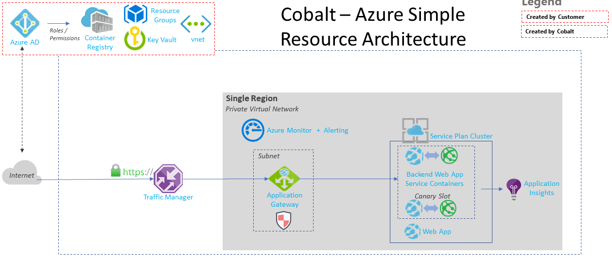

# Azure Simple

**THIS CONTENT IS NOT AUTOGENERATED.** 
Summary of template and its use cases. Required.
**//**

<!---
This content was generated automatically using filename of this document.
--->



<!---
This is a standard Table of Contents. Remove any optional sections that do not contain content.)
--->

**Table of Contents**
 - [Quickstart](#Quickstart)
    - [Template configuration](#Template-configuration)
    - [Module configuration](#Module-configuration)
    - [Deployment steps](#Deployment-steps)
    - [Sample output](#Sample-output)
 - [Features](#Features)
    - [Performance and load testing](#Performance-and-load-testing)
    - [Scaling](#Scaling)
    - [Cost](#Cost)
    - [Security](#Security)
    - [Authentication](#Authentication)
    - [Authorization](#Authorization)
    - [DevOps pipeline](#DevOps-pipeline)
    - [Monitoring](#Monitoring)
 - [In-depth guides](#In-depth-guides)
    - [Design rationale](#Design-rationale)
    - [Testing](#Testing) 
 - [References](#References)
    - [Reference apps](#Reference-apps)
    - [FAQ](#FAQ)
    - [Recommended reading](#Recommended-reading)


## Quickstart

<!---
This content was generated automatically using filename of this document.
--->

This quickstart guide will take you through `azure-simple` configuration, deployment, and expected outputs.


### Template configuration

<!---
This content was generated automatically from `variables.tf` using `terraform-docs` (https://github.com/segmentio/terraform-docs).
--->

| Name | Description | Type | Default | Required |
|------|-------------|:----:|:-----:|:-----:|
| address\_space | The address space that is used by the virtual network. | string | `"10.0.0.0/16"` | no |
| app\_service\_name | The name key value pair where the key is the name assigned to the app service and value is the source container | map | n/a | yes |
| appgateway\_backend\_http\_protocol | The backend protocol for the Appication Gateway to be created | string | `"Https"` | no |
| appgateway\_frontend\_port\_name | Name that will be given to the front-end port | string | n/a | yes |
| appgateway\_http\_listener\_protocol | The Http Listener protocol for the Appication Gateway to be created | string | `"Https"` | no |
| docker\_registry\_server\_password | The password used to authenticate with the container regitry | string | `""` | no |
| docker\_registry\_server\_url | The url of the container registry that will be utilized to pull container into the Web Apps for containers | string | `"index.docker.io"` | no |
| docker\_registry\_server\_username | The username used to authenticate with the container registry | string | `""` | no |
| name | The name of the deployment.  This will be used across the resource created in this solution | string | n/a | yes |
| resource\_group\_location | The deployment location of resource group container all the resources | string | n/a | yes |
| subnet\_names | A list of public subnets inside the vNet. | list | `<list>` | no |
| subnet\_prefixes | The address prefix to use for the subnet. | list | `<list>` | no |
| subnet\_service\_endpoints | The list of service endpoints that will be given to each subnet | list | `<list>` | no ||


### Module configuration

<!---
This content was generated automatically from `main.tf`.
--->

Each module in the `azure-simple` template contains its own configuration options. Click the links below to learn more.
 - [`service-plan`](https://microsoft.github.io/orion/service-plan#Configuration)
 - [`app-service`](https://microsoft.github.io/orion/app-service#Configuration)
 - [`app-insights`](https://microsoft.github.io/orion/app-insights#Configuration)


### Deployment steps

Create a new Terraform template directory and add a `main.tf` file. Here's a sample that uses the `azure-simple` template.

**THIS CONTENT IS NOT AUTOGENERATED.**
```
module "azure-simple" {
  name                            = "cobalt-azure-simple"
  resource_group_location         = "eastus"
  source                          = "https://github.com/microsoft/cobalt/tree/master/infra/templates/azure-simple"
  app_service_name                = {cobalt-backend-api = "DOCKER|msftcse/cobalt-azure-simple:0.1"}
}
```
**//**

Call the `terraform init`, `terraform plan`, and `terraform apply` commands within the template directory to initialize the Terraform deployment then write and apply the plan.

**THIS CONTENT IS NOT AUTOGENERATED.**
```
export TF_VAR_remote_state_account=<tf-remote-state-storage-account-name>
export TF_VAR_remote_state_container=<tf-remote-state-storage-container-name>
terraform init -backend-config "storage_account_name=${TF_VAR_remote_state_account}" -backend-config "container_name=${TF_VAR_remote_state_container}"
terraform plan
terraform apply
```
**//**

<!---
This content will be generated by [TBD].
--->

The following resources will be created:

 - Linux App Service Plan
 - App Service Container + staging slot
 - Application Insights Instance
 - vnet + subnet for app gateway
 - Application Gateway with an enabled Firewall
 - Traffic Manager Profile
 - Traffic Manager Endpoint
 - Azure Monitoring Rules
 - Public IP(for TM + AG)


### Outputs

<!---
This content was generated automatically from `ouputs.tf` using `terraform-docs` (https://github.com/segmentio/terraform-docs).
--->

| Name | Description |
|------|-------------|
| app\_service\_default\_hostname |  |
| app\_service\_name |  


## Features

### Performance and load testing

<!---
This content will be generated by [TBD].
--->


### Scaling

<!---
This content will be generated by [TBD].
--->

Autoscaling rules can refer to scaling based on time or metrics. For example: 

  - Rule 1: Scale out instances by one if CPU usages exceeds 70%.
  - Rule 2: Scale in instances by one if CPU falls below 30% for more than 5 minutes.

### Cost

<!---
This content will be generated by [TBD].
--->

Use the [Azure Pricing Calculator](https://azure.microsoft.com/en-us/pricing/calculator/) to estimate costs for [the resources generated by `azure-simple`](#Deployment-steps).

### Security

### Authentication

### Authorization

### DevOps pipeline


### Monitoring

There are a number of monitoring options for this solutions, including Azure Dashboards, Azure Monitor Views, Power BI, and Grafana.

For more information, refer to [Visualizing data from Azure Monitor](https://docs.microsoft.com/en-us/azure/azure-monitor/visualizations) on Microsoft Docs.

## In-depth guides

### Design rationale

**THIS CONTENT IS NOT AUTOGENERATED.** 
Content about design rationale. Optional.
**//**

### Testing

<!---
This content will be generated by [TBD].
--->

These are the basic steps for testing.
  1. Step one.
  2. Step two.
  3. Step three.


## References


### Reference apps

These sample applications can be deployed with `azure-simple`.

<!---
This content will be generated by [TBD].
--->

  - [Helium](https://github.com/microsoft/helium)


### FAQ

<!---
This content will be generated by [TBD].
--->
 > **Q: Question one?**
 >
 > A: Answer one.

 > **Q: Question two?**
 >
 > A: Answer two.

### Recommended reading

<!---
This content will be generated by [TBD].
--->

 - [Azure autoscaling](https://docs.microsoft.com/en-us/azure/architecture/best-practices/auto-scaling)
 - [Visualizing data from Azure Monitor](https://docs.microsoft.com/en-us/azure/azure-monitor/visualizations)