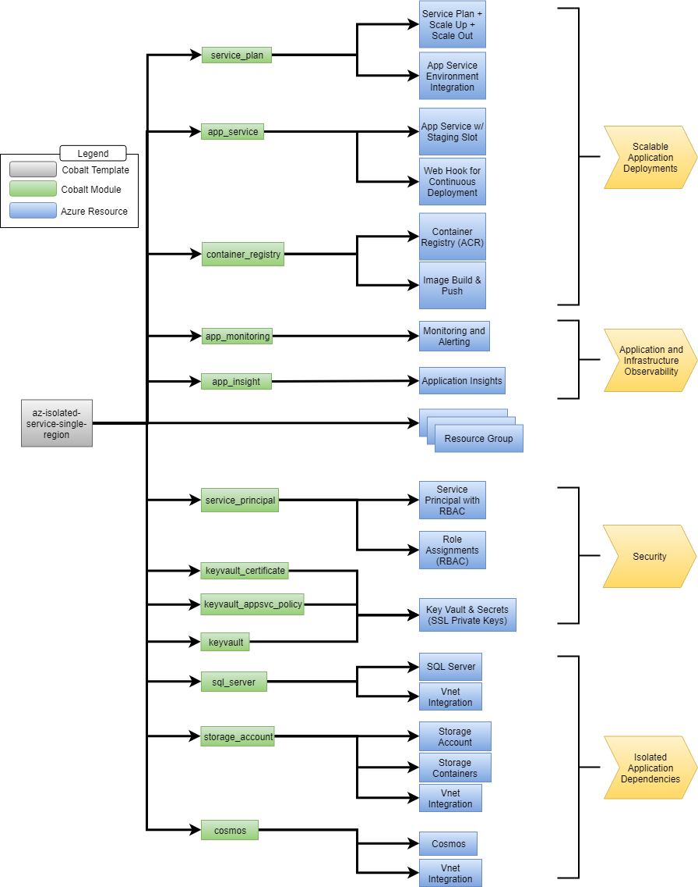

# Deploying App Service into ASE 

v0.1 - 6/19/2019 

## Introduction 

Some of Cobalt’s enterprise customers have strict security guidelines that have led them to leverage Azure App Service Environments (ASE) as their primary infrastructure target when deploying to Azure. This is a natural choice as ASE enables customers to deploy to a single-tenant fleet of hosts running in a secure and isolated network that can be hooked into internal client-owned networks without traversing the public internet. 

This document outlines how Cobalt can be extended to meet the use cases of these customers. The intended audience of this document is the development and product teams working on Cobalt and related projects. 

## In Scope 

- Identify deployment topology needed by the customer 
- Identify key Terraform templates needed for deployment
- Identify key Terraform modules needed for deployment
- Identify gaps in Terraform provider templates

## Out of scope 

- External customer sign-off
- Template (Terraform, ARM) implementation

 

## Key Terms 
- **RG**: Abbreviation for “Resource Group” 
- **Sub**: Abbreviation for “Subscription” 
- **Persona**: An archetype of a Cobalt customer 
- **Stage**: An application deployment stage (dev, qa, pre-prod, prod, etc...) 
- **Region**: A location in which an application is deployed 

 

## Customers 
- **Admin**: This persona represents an administrator of Azure. This persona does not implement the line of business applications but will help other teams deliver them. 
- **App Developer Team**: This persona is responsible for creating and maintaining the line of business applications 

## Open Questions 

These open questions may impact the implementation plan and overall scope of the deployment described below 

- What is the clients use case for Cosmos? Who manages these instances, and should we be automating the creation of them? Do we create the RG hosting Cosmos? If not, who owns this?
- What infrastructure resources do the app developer team need ownership over?
- How are SSL certificates managed?
- What is the cardinality of `certificate <--> app service`?

## Deployment Topology 

This graphic shows the targeted deployment topology needed by our enterprise customers. The deployment is split across 3 subscriptions, each subscription belonging to a single tenant. The resources are partitioned to align with the different personas within the customer – subscription 1 & 3 are where admin resources exist, whereas subscription 2 hosts the application developer team resources. 


## Template Topology 

The graphic below outlines the topology of the terraform templates that will deploy the topology called out above. By leveraging a multi-subscription deployment via [provider aliasing](https://www.terraform.io/docs/configuration/providers.html#alias-multiple-provider-instances) we can use a single template to target multiple Azure subscriptions.




## Question & Answer 

> Why not split the deployment along the subscription boundary? Doing so will maintain a 1-1 mapping between template and Azure subscription and it naturally splits along the same structure as our customer’s organization? 

Having a single template reduces the coordination required to manage deployment orchestration and secrets management. While this may be useful for more complex cases, it will need a design of its own as it requires some hard thinking about deployment orchestration and composition. 

> Is deploying to different subscriptions from a single template difficult? 

No. It can be achieved using [provider aliasing](https://www.terraform.io/docs/configuration/providers.html#alias-multiple-provider-instances).

> What if the clients want to split deployments across teams so that their organizational structure is reflected by the terraform templates? 

We would need to partition the resources from the template based on provider (I.e., Azure subscription) and identify a strategy to pass outputs from template to template in a secure and scalable fashion. We can delay this work until we know we need to do it. 

> Can >1 terraform templates run within the same workspace? For example, is it possible for an admin to deploy core infrastructure while the app developer team deploys scaling rules and monitoring configuration?

Only one terraform template can be deployed within a given workspace. The use case called out above could, however, be accomplished by leveraging two different workspaces or by using a single workspace with a single terraform template that refers to terraform configuration that lives in a separate repository. In the latter scenario, the remote configuration can be imported by specifying a [remote source argument](https://www.terraform.io/docs/configuration/modules.html).
 

## Module and Template Deep Dive

### Template Inputs
| name | type | default | description |
|---|---|---|---|
| `resource_group_location` | string |  | The deployment location of resource group container all the resources |
| `name` | string |  | The name of the deployment.  This will be used across the resource created in this solution |
| `app_service_containers` | map(str) |  | The name key value pair where the key is the name assigned to the app service and value is the source container |
| `metrics_configuration` | MetricsConfig **see below** | `[]` | A list of metrics configuration that should be configured for the app service plan |
| `monitoring_dimension_values` | `["*"]` |  | Dimensions used to determine service plan scaling |
| `ase_vnet_name` | string |  | The name of the VNET in which the ASE lives |
| `service_plan_scaling_rules` | list(rule) **see below** | `[]` | A list of scaline rules to apply to the service plan
| `provision_sql` | bool | `false` | True if SQL Server should be deployed, false otherwise
| `provision_storage_account` | bool | `false` | True if s storage account should be deployed, false otherwise
| `enable_auth` | bool | `true` | Whether or not to secure the application with active directory
| `authenticated_clients` | list(string) | `[]` | List of clients to authenticate if `enable_auth` is true

**Notes**

 - The above list may change as we track down requirements for Cosmos
 - `rule` is a type defined [here](https://www.terraform.io/docs/providers/azurerm/r/monitor_autoscale_setting.html#rule)
 - `MetricsConfig` is a [complex map type](https://www.hashicorp.com/blog/terraform-0-12-rich-value-types) that adheres to this schema:
```hcl
list(map(object({
	action_group_name           = string
	action_group_email_receiver = string
	metrics = list(map(object({
		metric_alert_name                 = string
		metric_alert_frequency            = string
		metric_alert_period               = string
		metric_alert_criteria_namespace   = string
		metric_alert_criteria_name        = string
		metric_alert_criteria_aggregation = string
		metric_alert_criteria_operator    = string
		metric_alert_criteria_threshold   = string
	})))
})))
```

### Template Outputs
| name | type | description |
|---|---|---|
| `public_certs` | map(string) | Map of app service name to public key usable with HTTPS connection |
| `fqdns` | map(string) | Map of app service name to VNET accessible domain name |
| `service_principal_object_id` | string | Service principal object ID |
| `service_principal_application_id` | string | Service principal application ID |
| `acr_endpoint` | string | ACR endpoint | 
| `key_vault_endpoint` | string | Key Vault endpont |
| `sql_server_endpoint` | string | SQL Server endpont |
| `blob_storage_endpoint` | string | Blob Storage endpoint |
| `cosmos_endpoint` | string | Cosmos endpont |
| `acr_registry_server_url` | string | ACR registry that hosts application containers |
| `acr_registry_server_username` | string | Username for acr registry **Note: required until ACR MSI supported via App Service** |
| `acr_registry_server_password` | string | Password for acr registry **Note: required until ACR MSI supported via App Service** |
| `aad_application_id` | string | ID of Azure Active Directory application created to handle authn/authz |

### Firewall Implementation 
Virtual Service Endpoints (VSE) will be used to restrict access to key services to a targeted VNET that is managed by the customer. An overview of this feature can be found [here](https://docs.microsoft.com/en-us/azure/virtual-network/virtual-network-service-endpoints-overview).

**Note:** App Service VNET integration is managed for the customer through their existing ASE deployments. VSE is supported for this resource but it is not required for this project.

| Azure Service | Supports VSE? | VSE Supported in Terraform? | Supported in Cobalt? |
|---|---|---|---|
| Key Vault | [Yes](https://docs.microsoft.com/en-us/azure/key-vault/key-vault-overview-vnet-service-endpoints) | [Yes](https://www.terraform.io/docs/providers/azurerm/r/key_vault.html#network_acls) | [No](https://github.com/microsoft/cobalt/blob/master/infra/modules/providers/azure/keyvault/main.tf) - Missing Configuration |
| Azure Storage | [Yes](https://docs.microsoft.com/en-us/azure/storage/common/storage-network-security?toc=%2fazure%2fvirtual-network%2ftoc.json#grant-access-from-a-virtual-network) | [Yes](https://www.terraform.io/docs/providers/azurerm/r/storage_account.html#virtual_network_subnet_ids) | [No](https://github.com/microsoft/cobalt/pull/183/files) - Missing configuration |
| ACR | [Undocumented but Verified to Work](https://docs.microsoft.com/en-us/azure/container-registry/container-registry-vnet) | [No - Possible through az CLI commands](https://www.terraform.io/docs/providers/azurerm/r/container_registry.html) | No |
| Azure SQL | [Yes](https://docs.microsoft.com/en-us/azure/sql-database/sql-database-vnet-service-endpoint-rule-overview?toc=%2fazure%2fvirtual-network%2ftoc.json) | [Yes](https://www.terraform.io/docs/providers/azurerm/r/sql_virtual_network_rule.html#subnet_id) | No - Module Not Written |
| Cosmos | [Yes](https://docs.microsoft.com/en-us/azure/cosmos-db/vnet-service-endpoint?toc=%2fazure%2fvirtual-network%2ftoc.json) | [Yes](https://www.terraform.io/docs/providers/azurerm/r/cosmosdb_account.html#virtual_network_rule) | [No](https://github.com/microsoft/cobalt/blob/master/infra/modules/providers/azure/cosmosdb/main.tf) - Missing Configuration |

### Credential Management
Managed Identities (MI, or MSI) will be used to manage access to credentials when possible. This table identifies MSI support for each resource leveraged by the template (full compatability breakdown [here](https://docs.microsoft.com/en-us/azure/active-directory/managed-identities-azure-resources/services-support-managed-identities)):

| Azure Service | Supports MSI | Mitigation Strategy |
|---|---|---|
| App Service | Yes | N/A |
| ACR | No | enable username/password access |
| Key Vault | Yes | N/A |
| Blob Storage | Yes | N/A |
| Cosmos | No | Credentials stored in Key Vault |
| SQL Server | Yes | N/A |

### Risks

Risks surrounding ACR:
 - ACR tasks cannot be run for ACRs deployed with VNET isolation. [Documentation](https://docs.microsoft.com/en-us/azure/container-registry/container-registry-vnet) is here and the [PG knows](https://github.com/MicrosoftDocs/azure-docs/issues/29459) about this limitation. [CSE Feedback](https://dev.azure.com/csefy19/CSE%20Feedback/_workitems/edit/234070/) has been submitted as well.
   - Mitigation strategy: The ACR task is needed only to seed the repository with an initial image. We can sequence the ACR creation like so to work around this issue. (1) Create ACR, (2) Submit ACR task to build/push initial image, (3) Create network ACL restrictions
 - Currently ACR MSI access is not supported. This feedback has been submitted to the Azure PG for consideration ([here](https://dev.azure.com/csefy19/CSE%20Feedback/_workitems/edit/231483)) and we can use a username/password as a **temporary** workaround.

## Security

Here is an overview of the security for the deployment strategy and templates discussed above: 

- **Role Assignments**: The service principal used for the deployment will have owner-access in all accounts. It will create a service principal that will be handed off to the application developer team. The following role assignments will be made:
  - Contributor access to App Service & App Insights in Resource Group #1
  - Contributor access to Resource Group #2. *If needed, we can lock this down further by granting role access to individual resources in this RG.*
- **Service to Service communication**: For services owned by the application development team persona we will leverage Managed Service Identity (MSI) for authenticating to cloud services wherever possible. Where this is not possible, MSI will be used to pull credentials from Key Vault. This connection is done via MSI and therefore it keeps all secrets out of the codebase. This limits the attack vector of the infrastructure. [List of services that support MSI](https://docs.microsoft.com/en-us/azure/active-directory/managed-identities-azure-resources/services-support-managed-identities)
- **Authentication and Authorization (AuthN/AuthZ)**: A strategy for gating access to the resources described in this document is outlined in another design covered by [Story 179](https://github.com/microsoft/cobalt/issues/179)
